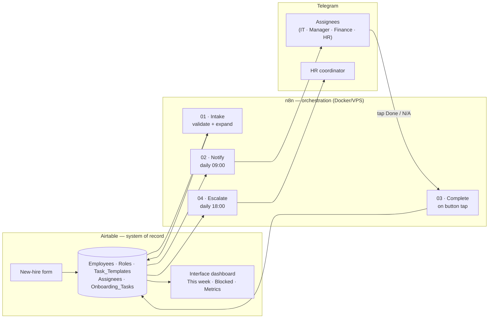
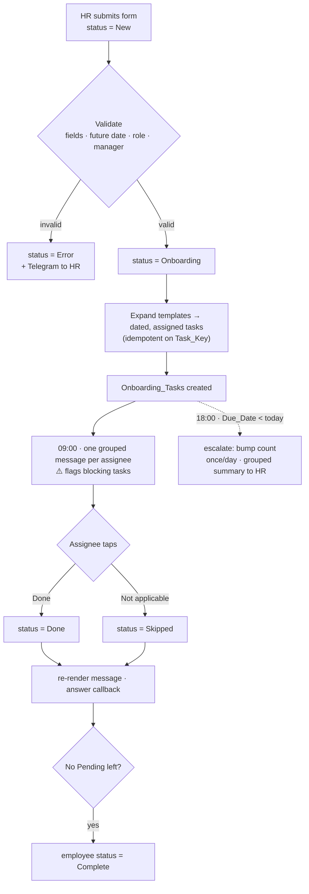
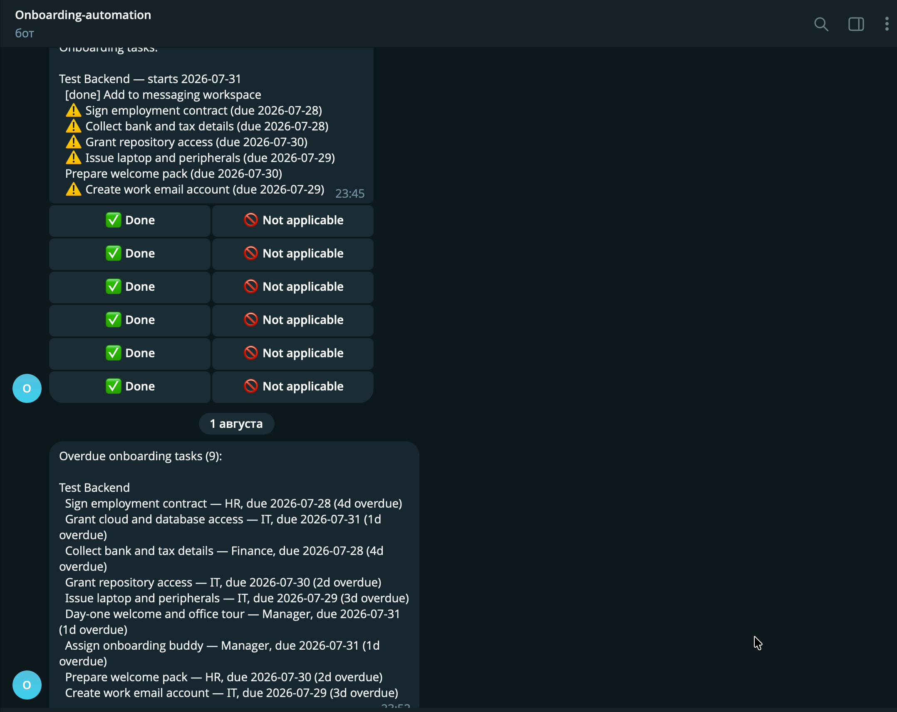
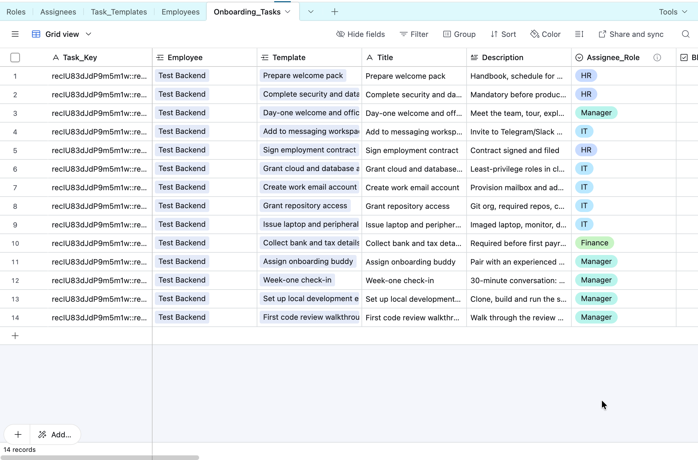
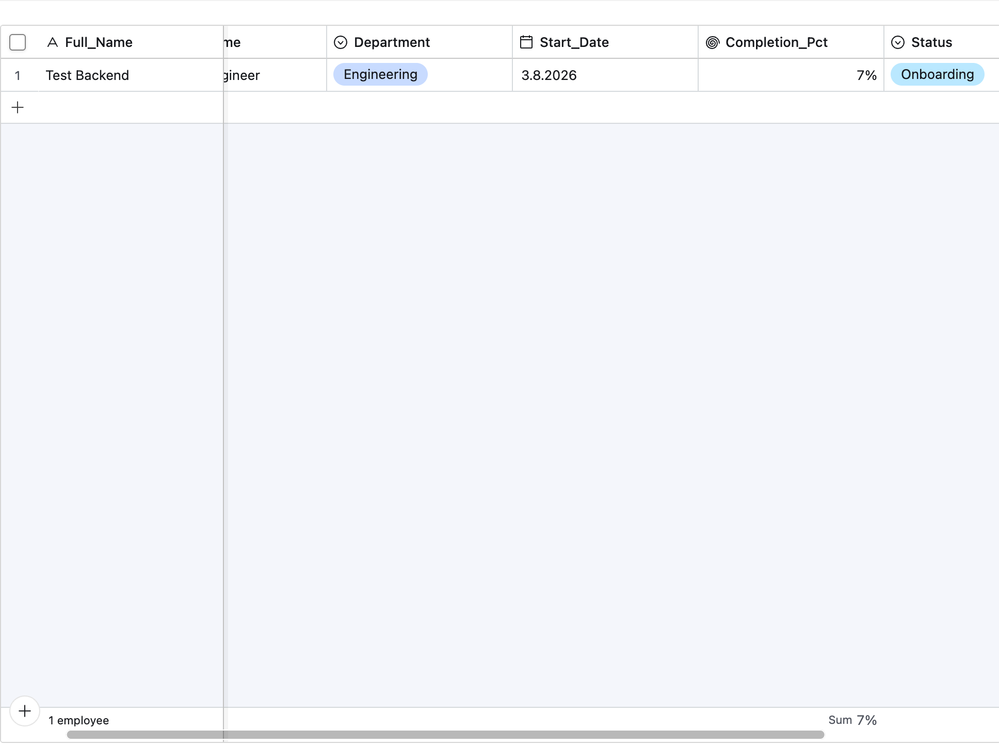
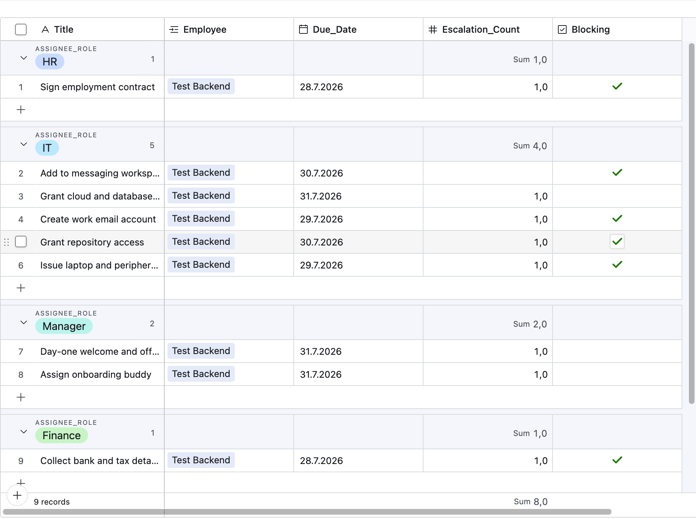

# Employee Onboarding Automation

Automates employee onboarding from offer acceptance to the end of week one: role-based task
generation, assignment, reminders, escalation and a reporting dashboard.

---

## The problem

Onboarding is a checklist that lives in someone's head. Steps are missed, IT finds out about a new
hire the morning they arrive, and nobody can answer "is everyone starting Monday ready?" without
asking four people.

I ran service-business operations for five years and hired and onboarded staff myself, so this is
the manual process I know best.

## What it does

1. HR submits a form for a new hire.
2. The system expands a **role-based template** into dated tasks — a backend engineer and a service
   technician get genuinely different onboarding (14 vs 15 tasks from the same 21 templates).
3. Deadlines are computed relative to the start date and shifted off weekends (forward for tasks
   after the start, backward for prep tasks, so a "3 days before" task never lands on a weekend).
4. Each assignee gets **one grouped Telegram message**, not one per task, and marks tasks done —
   or "not applicable" — from inline buttons.
5. Overdue tasks escalate to HR once a day.
6. A dashboard shows who is starting this week, readiness per person, and where things are stuck.

## Architecture



Logic (dates, template expansion, validation, message building, escalation) lives as pure,
tested JavaScript in [`scripts/`](scripts/) and is mechanically inlined into the n8n Code nodes —
never hand-written twice. See [Under the hood](#under-the-hood).

## End-to-end flow



## Screenshots

One grouped Telegram message per assignee with inline completion buttons, the generated task
list, and the dashboard.

| | |
|---|---|
|  |  |
|  |  |

## Stack

Airtable (system of record + business UI) · n8n, self-hosted on a VPS via Docker (orchestration) ·
JavaScript / Node.js (logic) · Telegram Bot API (notifications and actions) · Airtable Interfaces
(dashboard).

## Data model

Five tables — `Employees`, `Roles`, `Task_Templates`, `Assignees`, `Onboarding_Tasks`. Full field
list in [`docs/SCHEMA.md`](docs/SCHEMA.md). Three decisions worth calling out:

**Templates are data, not logic.** HR changes the onboarding process by editing the
`Task_Templates` table — 21 rows today — not by asking an engineer to touch a workflow. That is the
difference between an automation that survives and one that gets abandoned.

**Generated tasks snapshot their template fields** — title, description, assignee role, blocking
flag and category. Editing a template later must not rewrite the history of onboardings that
already happened; a task that was blocking for that hire stays blocking. Live facts (the employee's
name, start date) are *not* snapshotted — they are read from `Employees` when needed.

**No separate `Notifications` table.** The Telegram message id and chat id live on
`Onboarding_Tasks`. A message is a one-to-many over tasks, so the foreign key belongs on the task
side; the message id doubles as the grouping key for re-rendering a message when a button is tapped.

## Why Airtable, not Postgres

Postgres would be a cleaner store, and I would normally reach for it. Airtable is the deliberate
choice because HR needs to edit templates, run views and read the dashboard **without an engineer
in the loop** — the system of record has to be a place non-technical staff work directly. The
tradeoff is explicit: rate limits (handled with batched writes), no true database constraints, and
formula/JS keys instead of real ones. Naming that tradeoff is the point — it is a judgement call,
not an accident.

## Engineering notes

- **Idempotency, two layers.** Intake only picks up `status = New` and flips it to `Onboarding`
  first, so a re-run never sees the record twice; on top of that every task carries a deterministic
  `Task_Key` (`employeeId::templateId`) that de-dupes creation. Webhooks and schedulers fire twice;
  systems that assume otherwise corrupt data quietly.
- **No silent failures.** Every workflow has an error path to HR. A failed Telegram send is matched
  back to its group **by chat id, not by position**, so one blocked recipient can't misattribute
  another person's message — the undelivered ones are reported to HR and retried, never half-written.
- **Logic outside the low-code tool.** Date math, expansion, validation, message building and
  escalation are pure functions in [`scripts/`](scripts/) with **58 `node:test` cases**, then
  inlined into n8n Code nodes by a small build step. Testable, reviewable, portable if the platform
  changes. The build even fails if two inlined modules would collide on a top-level name.
- **Grouped notifications.** Twelve separate messages get muted; one message per person per day
  gets read.
- **Timezone at the boundary only.** All "today" comparisons are computed in `OFFICE_TIMEZONE`
  (`Europe/Istanbul`) so a 09:00 run and a 23:30 run of the same day select the same tasks — the
  offset arithmetic itself is timezone-free and unit-tested.
- **Data minimisation.** Only name, work email, role and Telegram ID are stored. No documents, no
  personal contact details.

## Under the hood

```
scripts/            pure logic + tests (node --test)   ← the source of truth
  dates.js          calendar offset + weekend shifting
  expandTemplates.js role match + assignee resolution + Task_Key
  validate.js       intake validation
  notify.js         due selection, grouping, message + callback logic
  escalate.js       overdue selection + HR summary
  build-node-bundles.js   inlines scripts/ into the Code-node wrappers
  build-workflow-*.js     assembles the importable workflow JSON

workflows/          4 exported n8n workflows (credentials stripped)
  01-intake.json  02-notify.json  03-complete.json  04-escalate.json
  code-nodes/       thin wrappers + generated paste-ready Code-node bodies
```

```bash
npm test          # 58 pure-logic tests
npm run demo      # validate + expand a sample hire, no Airtable needed
npm run build:nodes && npm run build:intake   # regenerate Code nodes / workflow JSON
```

## Running it

1. Create the Airtable base and five tables per [`docs/SCHEMA.md`](docs/SCHEMA.md); import
   `data/roles.csv`, `data/assignees.csv`, `data/task_templates.csv` **in that order**.
2. Copy `.env.example` → `.env` and fill it: Airtable token + base id, `TELEGRAM_BOT_TOKEN`,
   `TELEGRAM_HR_CHAT_ID`, `OFFICE_TIMEZONE`. The **same bot** must back both the sender and the
   callback trigger.
3. Import `workflows/*.json` into n8n (the Code nodes arrive with their logic already inlined),
   attach the Airtable and Telegram credentials, set each workflow's timezone.
4. Build the dashboard by hand following [`docs/DASHBOARD.md`](docs/DASHBOARD.md).

## Status and scope

Built as a portfolio project by one person. It runs and it is deployed — but it **has not been
used by a real HR team**, and it is described that way deliberately. No invented metrics or client
names appear anywhere in this repo.

Not implemented, on purpose: ATS integration, offboarding, e-signature, SSO against a real identity
provider, multi-language. The dashboard's "complete by day 7" metric is an approximation (there is
no stored timestamp for when an employee *became* complete) — noted honestly in the spec.

## What I would do next

- Move the store to Postgres with Airtable as a read/edit view layer once the process stabilises.
- Add per-task SLA tracking and a weekly digest to the head of people.
- Serialise callback processing to close the double-tap race — harmless and documented today
  (see the known limitation in [`docs/SPEC.md`](docs/SPEC.md), F4), but worth removing at scale.

---

**Ibragim Salimgariev** — automation engineer, Antalya (GMT+3) · ibragim_0202@icloud.com
